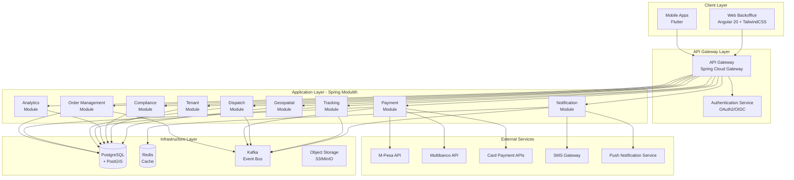
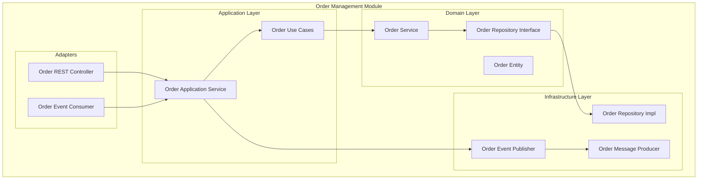

# Design Document: Multi-Tenant Delivery Platform

## Overview

The multi-tenant delivery platform is designed as a comprehensive solution for businesses across multiple verticals to offer delivery services in Mozambique. The system employs a modern microservices architecture using Spring Modulith with hexagonal architecture principles, ensuring scalability, maintainability, and proper separation of concerns.

The platform consists of three main components:
- **Mobile Applications**: Flutter-based Android/iOS apps for customers
- **Web Backoffice**: Angular 20 + TailwindCSS management interface for businesses with proper separation of concerns (*.ts, *.html, *.css files)
- **Backend Services**: Java 21 + Spring Boot + Spring Modulith with hexagonal architecture

Key architectural decisions prioritize multi-tenancy, geospatial capabilities, compliance requirements, and performance at scale.

## Architecture

### High-Level Architecture



### Spring Modulith Module Structure

The backend is organized into bounded contexts using Spring Modulith:

1. **Tenant Module**: Multi-tenant management and isolation
2. **Order Management Module**: Order lifecycle and business rules
3. **Payment Module**: Payment processing and multi-currency support
4. **Dispatch Module**: Delivery assignment and routing
5. **Tracking Module**: Real-time location and status tracking
6. **Notification Module**: Multi-channel communication
7. **Analytics Module**: Business intelligence and reporting
8. **Compliance Module**: Regulatory compliance and audit
9. **Geospatial Module**: Location-based services and routing
10. **Inventory Module**: Product and stock management
11. **User Management Module**: Authentication and authorization

### Angular 20 Web Backoffice Architecture

The web backoffice follows Angular best practices with strict separation of concerns:

**File Structure and Separation**:
- **Component Files**: Separate `.ts`, `.html`, and `.css` files for each component
- **Service Files**: Business logic and API communication in `.service.ts` files
- **Model Files**: TypeScript interfaces and types in `.model.ts` files
- **State Management**: NgRx for centralized state management
- **Styling**: TailwindCSS utility classes in separate `.css` files

**Module Organization**:
```
src/app/
├── core/                          # Core services and guards
│   ├── auth/                      # Authentication services
│   ├── guards/                    # Route guards
│   └── interceptors/              # HTTP interceptors
├── shared/                        # Shared components and utilities
│   ├── components/                # Reusable UI components
│   ├── pipes/                     # Custom pipes
│   └── directives/                # Custom directives
├── features/                      # Feature modules
│   ├── orders/                    # Order management
│   │   ├── components/
│   │   │   ├── order-list.component.ts
│   │   │   ├── order-list.component.html
│   │   │   └── order-list.component.css
│   │   ├── services/
│   │   │   └── order.service.ts
│   │   ├── models/
│   │   │   └── order.model.ts
│   │   └── store/                 # NgRx state management
│   │       ├── order.actions.ts
│   │       ├── order.reducer.ts
│   │       └── order.effects.ts
│   ├── analytics/                 # Analytics dashboard
│   ├── inventory/                 # Inventory management
│   └── settings/                  # Tenant configuration
└── layout/                        # Application layout components
    ├── header/
    ├── sidebar/
    └── footer/
```

**State Management with NgRx**:
- **Actions**: Define all user interactions and API calls
- **Reducers**: Pure functions handling state transitions
- **Effects**: Handle side effects like API calls
- **Selectors**: Derive data from the store state

### Hexagonal Architecture Implementation

Each module follows hexagonal architecture principles:



## Components and Interfaces

### Core Domain Models

#### Order Aggregate
```java
public class Order {
    private OrderId id;
    private TenantId tenantId;
    private CustomerId customerId;
    private List<OrderItem> items;
    private OrderStatus status;
    private DeliveryAddress deliveryAddress;
    private PaymentInfo paymentInfo;
    private Money totalAmount;
    private Currency currency;
    private Instant createdAt;
    private Instant updatedAt;
}
```

#### Tenant Aggregate
```java
public class Tenant {
    private TenantId id;
    private String name;
    private Vertical vertical;
    private List<City> serviceCities;
    private TenantConfiguration configuration;
    private TenantStatus status;
    private ComplianceSettings complianceSettings;
}
```

#### Delivery Aggregate
```java
public class Delivery {
    private DeliveryId id;
    private OrderId orderId;
    private DeliveryPersonId deliveryPersonId;
    private Route route;
    private DeliveryStatus status;
    private Location currentLocation;
    private Instant estimatedArrival;
    private List<DeliveryEvent> events;
}
```

### Module Interfaces

#### Order Management Module
```java
// Domain Service
public interface OrderService {
    Order createOrder(CreateOrderCommand command);
    Order updateOrderStatus(OrderId orderId, OrderStatus status);
    Order cancelOrder(OrderId orderId, CancellationReason reason);
    List<Order> findOrdersByTenant(TenantId tenantId, OrderFilter filter);
}

// Application Service
public interface OrderApplicationService {
    OrderResponse createOrder(CreateOrderRequest request);
    OrderResponse getOrder(OrderId orderId);
    List<OrderResponse> getOrdersForTenant(TenantId tenantId, OrderFilter filter);
    void cancelOrder(OrderId orderId, CancellationRequest request);
}

// Repository Interface
public interface OrderRepository {
    Order save(Order order);
    Optional<Order> findById(OrderId orderId);
    List<Order> findByTenantId(TenantId tenantId);
    List<Order> findByStatus(OrderStatus status);
}
```

#### Payment Module
```java
// Domain Service
public interface PaymentService {
    PaymentResult processPayment(PaymentRequest request);
    RefundResult processRefund(RefundRequest request);
    PaymentStatus getPaymentStatus(PaymentId paymentId);
}

// Payment Gateway Interface
public interface PaymentGateway {
    PaymentResult processPayment(PaymentMethod method, Money amount, Currency currency);
    RefundResult processRefund(PaymentId paymentId, Money amount);
    boolean supportsPaymentMethod(PaymentMethod method);
}

// Payment Method Implementations
public interface MPesaGateway extends PaymentGateway { }
public interface MultibancoGateway extends PaymentGateway { }
public interface CardPaymentGateway extends PaymentGateway { }
```

#### Dispatch Module
```java
// Domain Service
public interface DispatchService {
    DeliveryAssignment assignDelivery(OrderId orderId);
    Route optimizeRoute(List<OrderId> orderIds, DeliveryPersonId deliveryPersonId);
    void updateDeliveryStatus(DeliveryId deliveryId, DeliveryStatus status);
}

// Route Optimization Interface
public interface RouteOptimizer {
    Route calculateOptimalRoute(List<DeliveryAddress> addresses, Location startLocation);
    Duration estimateDeliveryTime(Route route, TrafficConditions conditions);
}
```

#### Geospatial Module
```java
// Domain Service
public interface GeospatialService {
    boolean isWithinServiceArea(Location location, City city);
    Distance calculateDistance(Location from, Location to);
    List<Tenant> findNearbyTenants(Location location, Distance radius);
    ServiceArea getServiceAreaForCity(City city);
}

// Location Tracking Interface
public interface LocationTracker {
    void updateLocation(DeliveryPersonId deliveryPersonId, Location location);
    Location getCurrentLocation(DeliveryPersonId deliveryPersonId);
    List<LocationHistory> getLocationHistory(DeliveryPersonId deliveryPersonId, TimeRange range);
}
```

### Event-Driven Communication

#### Domain Events
```java
// Order Events
public record OrderCreatedEvent(OrderId orderId, TenantId tenantId, CustomerId customerId, Instant timestamp) {}
public record OrderStatusChangedEvent(OrderId orderId, OrderStatus oldStatus, OrderStatus newStatus, Instant timestamp) {}
public record OrderCancelledEvent(OrderId orderId, CancellationReason reason, Instant timestamp) {}

// Payment Events
public record PaymentProcessedEvent(PaymentId paymentId, OrderId orderId, Money amount, PaymentStatus status, Instant timestamp) {}
public record RefundProcessedEvent(RefundId refundId, PaymentId paymentId, Money amount, RefundStatus status, Instant timestamp) {}

// Delivery Events
public record DeliveryAssignedEvent(DeliveryId deliveryId, OrderId orderId, DeliveryPersonId deliveryPersonId, Instant timestamp) {}
public record DeliveryLocationUpdatedEvent(DeliveryId deliveryId, Location location, Instant timestamp) {}
public record DeliveryCompletedEvent(DeliveryId deliveryId, OrderId orderId, Instant timestamp) {}
```

## Data Models

### Database Schema Design

#### Multi-Tenant Data Isolation
```sql
-- Tenant table
CREATE TABLE tenants (
    id UUID PRIMARY KEY,
    name VARCHAR(255) NOT NULL,
    vertical VARCHAR(50) NOT NULL,
    status VARCHAR(20) NOT NULL,
    configuration JSONB,
    compliance_settings JSONB,
    created_at TIMESTAMP WITH TIME ZONE DEFAULT NOW(),
    updated_at TIMESTAMP WITH TIME ZONE DEFAULT NOW()
);

-- Orders table with tenant isolation
CREATE TABLE orders (
    id UUID PRIMARY KEY,
    tenant_id UUID NOT NULL REFERENCES tenants(id),
    customer_id UUID NOT NULL,
    status VARCHAR(20) NOT NULL,
    items JSONB NOT NULL,
    delivery_address JSONB NOT NULL,
    payment_info JSONB NOT NULL,
    total_amount DECIMAL(10,2) NOT NULL,
    currency VARCHAR(3) NOT NULL,
    created_at TIMESTAMP WITH TIME ZONE DEFAULT NOW(),
    updated_at TIMESTAMP WITH TIME ZONE DEFAULT NOW()
);

-- Row Level Security for multi-tenancy
ALTER TABLE orders ENABLE ROW LEVEL SECURITY;
CREATE POLICY tenant_isolation_policy ON orders
    USING (tenant_id = current_setting('app.current_tenant_id')::UUID);
```

#### Geospatial Data Models
```sql
-- Service areas with PostGIS
CREATE TABLE service_areas (
    id UUID PRIMARY KEY,
    city VARCHAR(100) NOT NULL,
    boundary GEOMETRY(POLYGON, 4326) NOT NULL,
    tenant_id UUID REFERENCES tenants(id),
    created_at TIMESTAMP WITH TIME ZONE DEFAULT NOW()
);

CREATE INDEX idx_service_areas_boundary ON service_areas USING GIST (boundary);

-- Delivery locations
CREATE TABLE delivery_locations (
    id UUID PRIMARY KEY,
    delivery_id UUID NOT NULL,
    location GEOMETRY(POINT, 4326) NOT NULL,
    timestamp TIMESTAMP WITH TIME ZONE NOT NULL,
    accuracy DECIMAL(5,2)
);

CREATE INDEX idx_delivery_locations_geom ON delivery_locations USING GIST (location);
CREATE INDEX idx_delivery_locations_delivery_time ON delivery_locations (delivery_id, timestamp);
```

#### Payment and Currency Support
```sql
-- Payments table
CREATE TABLE payments (
    id UUID PRIMARY KEY,
    order_id UUID NOT NULL REFERENCES orders(id),
    payment_method VARCHAR(20) NOT NULL,
    amount DECIMAL(10,2) NOT NULL,
    currency VARCHAR(3) NOT NULL,
    exchange_rate DECIMAL(10,6),
    status VARCHAR(20) NOT NULL,
    gateway_transaction_id VARCHAR(255),
    gateway_response JSONB,
    created_at TIMESTAMP WITH TIME ZONE DEFAULT NOW(),
    updated_at TIMESTAMP WITH TIME ZONE DEFAULT NOW()
);

-- Currency exchange rates
CREATE TABLE exchange_rates (
    id UUID PRIMARY KEY,
    from_currency VARCHAR(3) NOT NULL,
    to_currency VARCHAR(3) NOT NULL,
    rate DECIMAL(10,6) NOT NULL,
    effective_date TIMESTAMP WITH TIME ZONE NOT NULL,
    created_at TIMESTAMP WITH TIME ZONE DEFAULT NOW()
);
```

### Caching Strategy

#### Redis Cache Structure
```java
// Cache Keys
public class CacheKeys {
    public static final String TENANT_CONFIG = "tenant:config:%s";
    public static final String ORDER_STATUS = "order:status:%s";
    public static final String DELIVERY_LOCATION = "delivery:location:%s";
    public static final String EXCHANGE_RATES = "exchange:rates:%s:%s";
    public static final String SERVICE_AREAS = "service:areas:%s";
}

// Cache Configuration
@Configuration
public class CacheConfig {
    @Bean
    public RedisCacheManager cacheManager(RedisConnectionFactory connectionFactory) {
        RedisCacheConfiguration config = RedisCacheConfiguration.defaultCacheConfig()
            .entryTtl(Duration.ofMinutes(30))
            .serializeKeysWith(RedisSerializationContext.SerializationPair.fromSerializer(new StringRedisSerializer()))
            .serializeValuesWith(RedisSerializationContext.SerializationPair.fromSerializer(new GenericJackson2JsonRedisSerializer()));
        
        return RedisCacheManager.builder(connectionFactory)
            .cacheDefaults(config)
            .build();
    }
}
```

## Error Handling

### Exception Hierarchy
```java
// Base exception
public abstract class DeliveryPlatformException extends RuntimeException {
    private final String errorCode;
    private final Map<String, Object> context;
    
    protected DeliveryPlatformException(String errorCode, String message, Map<String, Object> context) {
        super(message);
        this.errorCode = errorCode;
        this.context = context;
    }
}

// Domain-specific exceptions
public class OrderNotFoundException extends DeliveryPlatformException {
    public OrderNotFoundException(OrderId orderId) {
        super("ORDER_NOT_FOUND", "Order not found: " + orderId, Map.of("orderId", orderId));
    }
}

public class PaymentProcessingException extends DeliveryPlatformException {
    public PaymentProcessingException(String gatewayError, PaymentId paymentId) {
        super("PAYMENT_PROCESSING_FAILED", "Payment processing failed: " + gatewayError, 
              Map.of("paymentId", paymentId, "gatewayError", gatewayError));
    }
}

public class TenantAccessDeniedException extends DeliveryPlatformException {
    public TenantAccessDeniedException(TenantId tenantId, String resource) {
        super("TENANT_ACCESS_DENIED", "Access denied to resource: " + resource, 
              Map.of("tenantId", tenantId, "resource", resource));
    }
}
```

### Global Exception Handler
```java
@RestControllerAdvice
public class GlobalExceptionHandler {
    
    @ExceptionHandler(DeliveryPlatformException.class)
    public ResponseEntity<ErrorResponse> handleDeliveryPlatformException(DeliveryPlatformException ex) {
        ErrorResponse error = ErrorResponse.builder()
            .errorCode(ex.getErrorCode())
            .message(ex.getMessage())
            .context(ex.getContext())
            .timestamp(Instant.now())
            .build();
        
        HttpStatus status = mapErrorCodeToHttpStatus(ex.getErrorCode());
        return ResponseEntity.status(status).body(error);
    }
    
    @ExceptionHandler(ValidationException.class)
    public ResponseEntity<ErrorResponse> handleValidationException(ValidationException ex) {
        ErrorResponse error = ErrorResponse.builder()
            .errorCode("VALIDATION_ERROR")
            .message("Validation failed")
            .validationErrors(ex.getViolations())
            .timestamp(Instant.now())
            .build();
        
        return ResponseEntity.badRequest().body(error);
    }
}
```

### Circuit Breaker Pattern
```java
@Component
public class PaymentGatewayCircuitBreaker {
    
    private final CircuitBreaker circuitBreaker;
    
    public PaymentGatewayCircuitBreaker() {
        this.circuitBreaker = CircuitBreaker.ofDefaults("paymentGateway");
        circuitBreaker.getEventPublisher()
            .onStateTransition(event -> 
                log.info("Circuit breaker state transition: {}", event));
    }
    
    public PaymentResult processPayment(PaymentRequest request) {
        return circuitBreaker.executeSupplier(() -> {
            return paymentGateway.processPayment(request);
        });
    }
}
```

## Testing Strategy

### Testing Pyramid

The testing strategy follows a comprehensive approach with multiple layers:

1. **Unit Tests**: Test individual components and business logic
2. **Integration Tests**: Test module interactions and database operations
3. **Property-Based Tests**: Verify universal properties across all inputs
4. **Contract Tests**: Ensure API compatibility between services
5. **End-to-End Tests**: Validate complete user workflows

### Property-Based Testing Framework

We will use **jqwik** for property-based testing in Java, which provides excellent support for generating complex domain objects and testing universal properties.

```java
// Example property test configuration
@PropertyTest
@Tag("Feature: delivery-platform, Property 1: Order creation preserves data integrity")
void orderCreationPreservesDataIntegrity(@ForAll("validOrderRequests") CreateOrderRequest request) {
    // Property test implementation will be defined in tasks
}
```

### Test Configuration

- **Minimum 100 iterations** per property test due to randomization
- **Comprehensive input generation** using jqwik's domain-specific generators
- **Integration with Spring Boot Test** for dependency injection
- **Testcontainers** for database and external service testing
- **WireMock** for external API mocking

### Testing Tools and Libraries

- **JUnit 5**: Core testing framework
- **jqwik**: Property-based testing
- **Testcontainers**: Integration testing with real databases
- **WireMock**: External service mocking
- **Spring Boot Test**: Spring-specific testing support
- **AssertJ**: Fluent assertions
- **Mockito**: Mocking framework for unit tests

## Correctness Properties

*A property is a characteristic or behavior that should hold true across all valid executions of a system—essentially, a formal statement about what the system should do. Properties serve as the bridge between human-readable specifications and machine-verifiable correctness guarantees.*

Based on the requirements analysis, the following properties ensure the system behaves correctly across all valid inputs and scenarios:

### Property 1: Tenant Data Isolation
*For any* two different tenants and any data operation, data belonging to one tenant should never be accessible to or affect operations of another tenant.
**Validates: Requirements 1.1, 1.3, 1.5, 8.5**

### Property 2: Tenant Configuration Independence
*For any* tenant configuration change, the change should only affect that specific tenant's operations and not impact other tenants' behavior or data.
**Validates: Requirements 1.2, 1.5**

### Property 3: Geospatial Service Area Validation
*For any* location and city combination, the geospatial service should correctly determine whether the location is within the city's service boundaries.
**Validates: Requirements 2.1, 2.4**

### Property 4: Route Optimization Efficiency
*For any* set of delivery addresses within a city, the optimized route should be more efficient than a random ordering of the same addresses.
**Validates: Requirements 2.2, 7.2**

### Property 5: City-Based Search Filtering
*For any* user location and search query, all returned business results should be within the user's city and available for delivery to that location.
**Validates: Requirements 2.3**

### Property 6: Vertical-Specific Feature Assignment
*For any* business registration with a specific vertical, the platform should assign exactly the feature set appropriate for that vertical.
**Validates: Requirements 3.1, 3.4**

### Property 7: Pharmacy Compliance Enforcement
*For any* pharmacy order, the system should enforce prescription validation and age verification requirements that are not applied to other verticals.
**Validates: Requirements 3.2, 9.2**

### Property 8: Vertical Business Rules Application
*For any* order within a specific vertical, the system should apply exactly the business rules and validation appropriate for that vertical.
**Validates: Requirements 3.3, 3.5**

### Property 9: Order Creation Consistency
*For any* valid order creation request, the system should create an order with a unique identifier, correct initial status, and all required fields populated.
**Validates: Requirements 4.1**

### Property 10: Order Status Change Notification
*For any* order status change, the system should trigger appropriate notifications to all relevant stakeholders.
**Validates: Requirements 4.2, 6.1**

### Property 11: Order Cancellation Rule Enforcement
*For any* cancellation request, the system should process the cancellation according to the applicable business rules and refund policies for that order's context.
**Validates: Requirements 4.3**

### Property 12: Order Lifecycle Integration
*For any* order transitioning between lifecycle stages, the system should properly integrate with all relevant subsystems and maintain data consistency.
**Validates: Requirements 4.4, 4.5, 7.5**

### Property 13: Payment Method Support
*For any* supported payment method (M-Pesa, Multibanco/MB Way, cards), the payment gateway should successfully process valid payment requests.
**Validates: Requirements 5.1**

### Property 14: Multi-Currency Processing
*For any* payment in USD or MZN, the system should correctly handle currency conversion using current exchange rates when necessary.
**Validates: Requirements 5.2**

### Property 15: Payment Error Handling
*For any* payment processing failure, the system should provide clear error messages and appropriate retry mechanisms.
**Validates: Requirements 5.3**

### Property 16: Refund Processing Consistency
*For any* valid refund request, the system should process the refund to the original payment method according to business rules.
**Validates: Requirements 5.4**

### Property 17: Payment Data Encryption
*For any* sensitive payment data stored in the system, the data should be encrypted using industry-standard encryption methods.
**Validates: Requirements 5.5, 9.3**

### Property 18: Real-Time Tracking Updates
*For any* delivery in progress, the tracking service should provide current location data with estimated arrival times.
**Validates: Requirements 6.2, 6.4**

### Property 19: Critical Event Alerting
*For any* critical system event, the notification service should send immediate alerts to all relevant stakeholders.
**Validates: Requirements 6.3**

### Property 20: Delivery Completion Notifications
*For any* completed delivery, the system should send confirmation notifications with receipt information.
**Validates: Requirements 6.5**

### Property 21: Delivery Assignment Optimization
*For any* order ready for delivery, the dispatch system should assign it to available delivery personnel based on location proximity and capacity constraints.
**Validates: Requirements 7.1**

### Property 22: Dynamic Capacity Management
*For any* change in delivery capacity, the dispatch system should reassign orders to maintain service level commitments.
**Validates: Requirements 7.3**

### Property 23: Delivery Issue Handling
*For any* delivery issue that arises, the system should provide alternative routing options and escalation procedures.
**Validates: Requirements 7.4**

### Property 24: Analytics Data Accuracy
*For any* analytics report generation, the system should provide accurate real-time data with appropriate key performance indicators.
**Validates: Requirements 8.1**

### Property 25: Historical Analysis Capability
*For any* time period selection, the analytics engine should support trend analysis with customizable date ranges.
**Validates: Requirements 8.2**

### Property 26: Performance Benchmarking
*For any* performance comparison request, the system should provide benchmarking against appropriate industry standards.
**Validates: Requirements 8.3**

### Property 27: Data Export Functionality
*For any* data export request, the system should support all specified formats (PDF, Excel, CSV) with proper formatting.
**Validates: Requirements 8.4**

### Property 28: GDPR Compliance Enforcement
*For any* personal data operation, the system should enforce GDPR requirements including consent management and data portability rights.
**Validates: Requirements 9.1**

### Property 29: Audit Trail Completeness
*For any* critical system operation, the audit system should create immutable log entries with complete operation details.
**Validates: Requirements 9.4**

### Property 30: Fraud Detection Activation
*For any* suspicious activity detection, the system should automatically implement appropriate fraud prevention measures.
**Validates: Requirements 9.5**

### Property 31: Circuit Breaker Activation
*For any* system failure condition, circuit breakers should activate to prevent cascade failures and enable graceful degradation.
**Validates: Requirements 10.4**

### Property 32: Observability Data Generation
*For any* system operation, the platform should generate appropriate telemetry data for monitoring and observability.
**Validates: Requirements 10.5**

### Property 33: Mobile Search and Filtering
*For any* product search on mobile apps, the results should respect vertical-specific categories and applied filters.
**Validates: Requirements 11.1**

### Property 34: Multi-Store Cart Calculation
*For any* multi-store cart, the system should correctly calculate total pricing including individual store costs and delivery fees.
**Validates: Requirements 11.2**

### Property 35: Mobile Authentication Security
*For any* authentication attempt on mobile apps, the system should enforce secure authentication methods including biometric support where available.
**Validates: Requirements 11.4**

### Property 36: Offline Data Synchronization
*For any* offline mobile app usage, essential data should be cached and properly synchronized when connectivity is restored.
**Validates: Requirements 11.5**

### Property 37: Inventory Alert Generation
*For any* inventory level that falls below defined thresholds, the system should generate appropriate low-stock alerts.
**Validates: Requirements 12.1**

### Property 38: Order Queue Management
*For any* order processing in the web backoffice, orders should be properly sorted by priority and support batch processing operations.
**Validates: Requirements 12.2**

### Property 39: Role-Based Access Control
*For any* user access attempt, the system should enforce role-based permissions with complete audit logging.
**Validates: Requirements 12.4**

### Property 40: RESTful API Compliance
*For any* API endpoint, the implementation should follow RESTful principles and provide comprehensive documentation.
**Validates: Requirements 13.1**

### Property 41: OAuth2 Scope Enforcement
*For any* API access attempt, the system should properly validate OAuth2 tokens and enforce scope-based permissions.
**Validates: Requirements 13.2**

### Property 42: API Rate Limiting
*For any* API client, the system should enforce rate limits and throttling to prevent abuse while allowing legitimate usage.
**Validates: Requirements 13.3**

### Property 43: API Error Response Consistency
*For any* API error condition, the system should provide detailed error responses with troubleshooting guidance.
**Validates: Requirements 13.4**

### Property 44: API Backward Compatibility
*For any* API version, the system should maintain backward compatibility while supporting newer versions.
**Validates: Requirements 13.5**

### Property 45: Data Corruption Detection and Repair
*For any* data corruption detection, the system should trigger appropriate validation and repair mechanisms.
**Validates: Requirements 14.2**

### Property 46: Data Retention Policy Enforcement
*For any* data subject to retention policies, the system should automatically archive and clean up data according to defined schedules.
**Validates: Requirements 14.4**

## Testing Strategy

### Dual Testing Approach

The platform employs a comprehensive testing strategy that combines unit testing and property-based testing to ensure both specific correctness and universal properties:

**Unit Tests**:
- Verify specific examples and edge cases
- Test integration points between modules
- Validate error conditions and exception handling
- Focus on concrete scenarios and business logic validation

**Property-Based Tests**:
- Verify universal properties across all valid inputs
- Test system behavior with randomized data generation
- Ensure correctness properties hold under all conditions
- Provide comprehensive input coverage through automated generation

### Property-Based Testing Configuration

**Framework**: jqwik for Java property-based testing
- **Minimum 100 iterations** per property test to ensure comprehensive coverage
- **Domain-specific generators** for complex business objects (Orders, Tenants, Payments, etc.)
- **Integration with Spring Boot Test** for dependency injection and context management
- **Custom generators** for multi-tenant scenarios, geospatial data, and payment methods

**Test Tagging**: Each property-based test must include a comment tag referencing the design document property:
```java
@PropertyTest
@Tag("Feature: delivery-platform, Property 1: Tenant Data Isolation")
void tenantDataIsolationProperty(@ForAll("tenants") Tenant tenant1, @ForAll("tenants") Tenant tenant2) {
    // Test implementation
}
```

### Testing Tools and Infrastructure

**Core Testing Stack**:
- **JUnit 5**: Primary testing framework
- **jqwik**: Property-based testing implementation
- **Spring Boot Test**: Spring-specific testing support with test slices
- **Testcontainers**: Integration testing with real PostgreSQL, Redis, and Kafka
- **WireMock**: External service mocking for payment gateways and SMS services
- **AssertJ**: Fluent assertions for readable test code
- **Mockito**: Mocking framework for unit tests

**Test Data Management**:
- **Custom jqwik generators** for domain objects
- **Test data builders** for complex object creation
- **Database test fixtures** with tenant isolation
- **Geospatial test data** with PostGIS integration

**Integration Testing**:
- **Module integration tests** using Spring Modulith testing support
- **Event-driven testing** with Kafka test containers
- **Multi-tenant test scenarios** with proper data isolation
- **Performance testing** for critical paths (order processing, payment handling)

### Test Organization

Tests are organized by module following the hexagonal architecture:

```
src/test/java/
├── unit/                          # Unit tests for individual components
│   ├── domain/                    # Domain logic tests
│   ├── application/               # Application service tests
│   └── infrastructure/            # Infrastructure adapter tests
├── integration/                   # Integration tests between modules
│   ├── order/                     # Order management integration
│   ├── payment/                   # Payment processing integration
│   └── dispatch/                  # Dispatch system integration
├── property/                      # Property-based tests
│   ├── TenantIsolationProperties.java
│   ├── OrderLifecycleProperties.java
│   ├── PaymentProcessingProperties.java
│   └── GeospatialProperties.java
└── e2e/                          # End-to-end workflow tests
    ├── OrderToDeliveryWorkflow.java
    └── MultiTenantScenarios.java
```

Each correctness property from the design document must be implemented as a separate property-based test, ensuring comprehensive validation of system behavior across all valid inputs and scenarios.